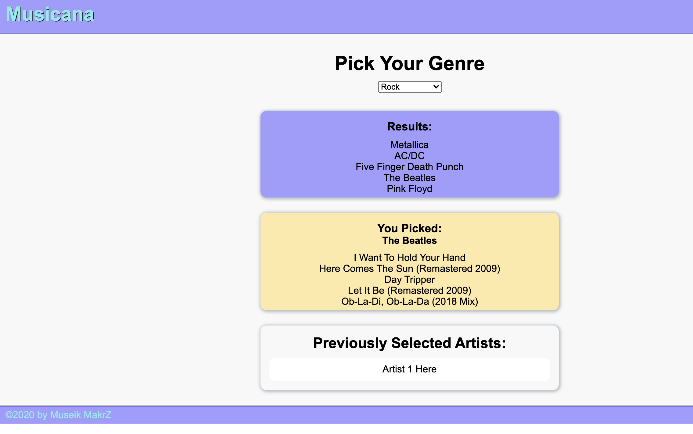

# Musicana

## by Dennis Lee, Victor McGuire and Aaron Rosenblatt
#### We combined our work to write JavaScript, HTML and CSS from scratch to create a music application that allows a user to discover new music. The user selects a music genre and five random artists will display. The user can then select an artist and that artist's top five songs will display. The app runs in a browser and the JavaScript uses jQuery, Foundation and the Deezer API library. Musicana is designed for mobile-friendly use and features a dropdown menu and 12 different music genres including a "random" category. When the user selects an artist then that artist's name will appear in a "previously selected artist" container. 

### The GitHub repository for Musicana can be viewed here: https://github.com/noplur/team4-10-music
### The link to the website of Musicana can be viewed here: https://noplur.github.io/team4-10-music/

### Here is a screenshot of Musicana:
### 